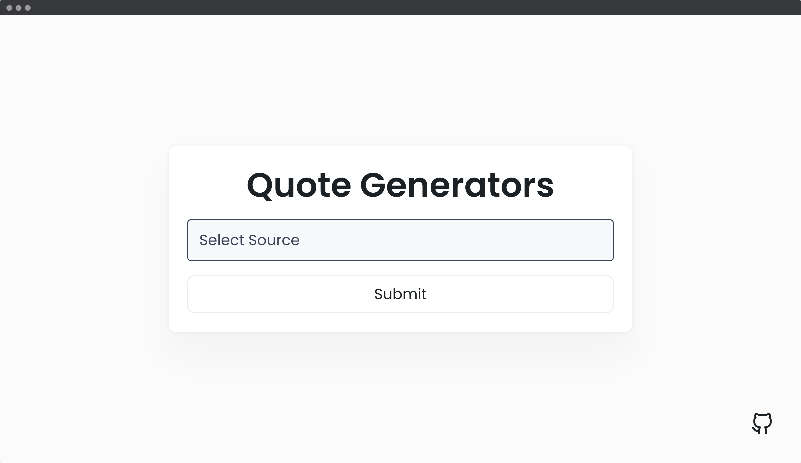
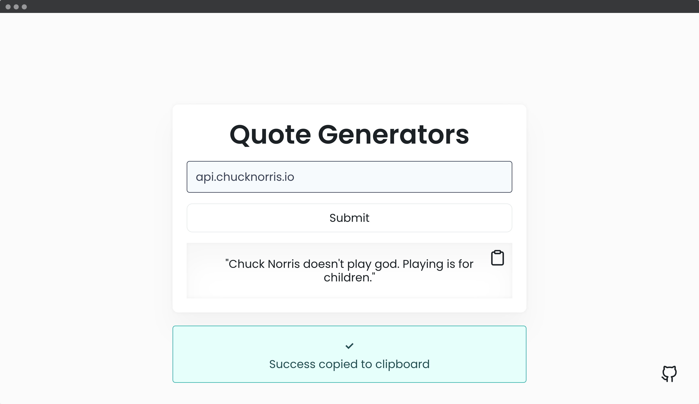

## 📦 Quote Generators App

In this app you can get a random joke or quote from API.

---
#### 🌄 Screenshots:

-----

#### 💻 Stack:

- [JavaScript](https://learn.javascript.ru/)
- [Sass](https://sass-lang.com/)
- 
#### 💻 API:
- [api.chucknorris.io](https://api.chucknorris.io/jokes/random)
- [api.quotable.io](https://api.quotable.io/random)
- [type.fit](https://type.fit/api/quotes)
- [api.api-ninjas.com](https://api.api-ninjas.com/v1/quotes)
- [api.goprogram.ai](https://api.goprogram.ai/inspiration)
- [favqs.com](https://favqs.com/api/qotd)
- [api.themotivate365.com](https://api.themotivate365.com/stoic-quote)
- [quotesondesign.com](https://quotesondesign.com/wp-json/wp/v2/posts/?orderby=rand)
- [affirmations.dev](https://www.affirmations.dev/)
- [ron-swanson-quotes](https://ron-swanson-quotes.herokuapp.com/v2/quotes)
- [evilinsult.com](https://evilinsult.com/generate_insult.php?lang=en&type=json)
- [api.forismatic.com](https://api.forismatic.com/api/1.0/?method=getQuote&lang=en&format=json)
- [motivational-quotes](https://motivational-quotes1.p.rapidapi.com/motivation)
- [official-joke-api](https://official-joke-api.appspot.com/random_joke)

-----
#### 🙌 Author: [@nagoev-alim](https://github.com/nagoev-alim)
